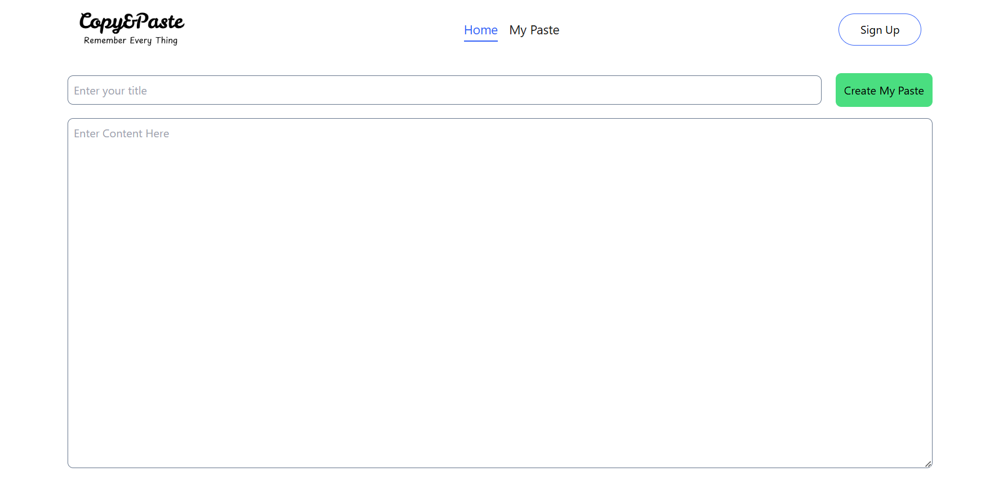
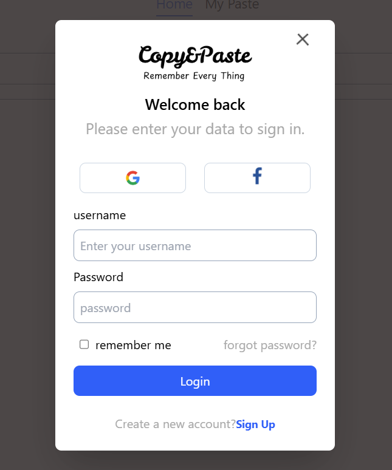
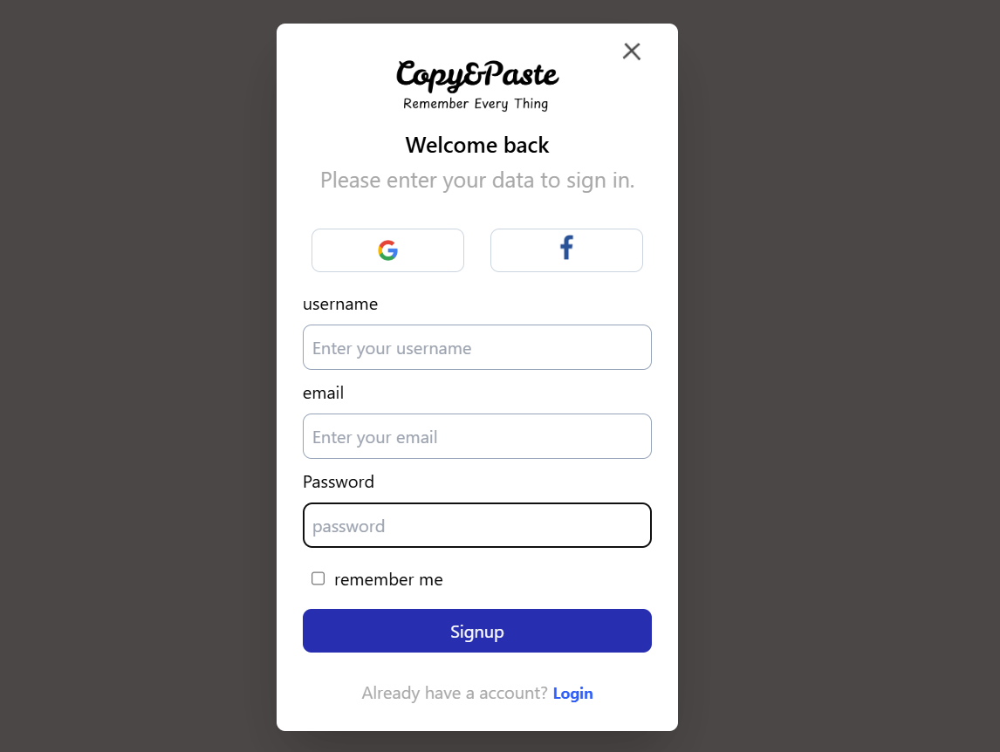
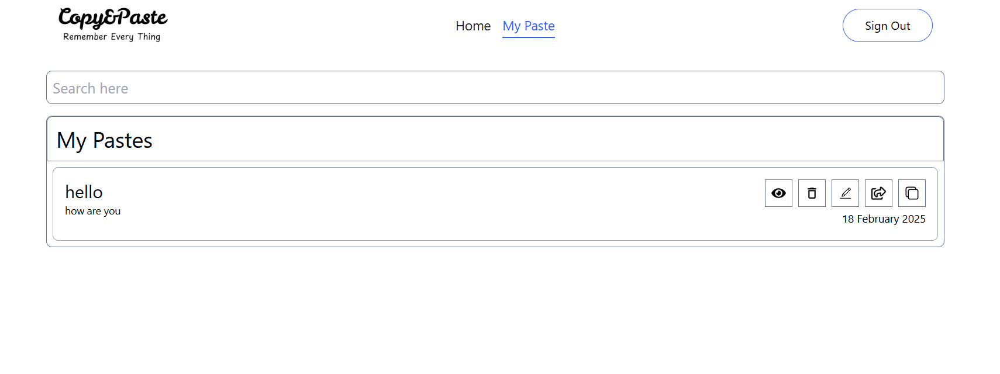

# Copy&Paste - MERN Stack Note-Taking App

Copy&Paste is a **MERN stack** application that allows authenticated users to create, save, and manage their notes securely. Each user can only access their own notes, ensuring privacy and data security.
## Screenshots








## Features

- **User Authentication**: Secure login and registration using JWT.
- **Create Notes**: Users can add new notes.
- **Edit & Delete Notes**: Modify or remove notes as needed.
- **Secure Storage**: Each user's notes are stored in MongoDB and can only be accessed by them.
- **Responsive UI**: Optimized for all devices.

## Tech Stack

- **Frontend**: React, Redux Toolkit, Tailwind CSS
- **Backend**: Node.js, Express.js, MongoDB
- **Authentication**: JWT-based authentication
- **Database**: MongoDB with Mongoose ORM

## Installation

### Prerequisites

Ensure you have the following installed:

- [Node.js](https://nodejs.org/)
- [MongoDB](https://www.mongodb.com/try/download/community)

### Clone the Repository

```sh
git clone https://github.com/your-username/Copy-Paste.git
cd Copy-Paste
```

### Install Dependencies

#### Backend

```sh
cd server
npm install
```

#### Frontend

```sh
cd client
npm install
```

### Environment Variables

Create a `.env` file in the `server` directory and add:

```env
PORT=5000
MONGO_URI=your_mongodb_connection_string
JWT_SECRET=your_jwt_secret
```

### Run the Application

#### Start Backend

```sh
cd server
npm run dev
```

#### Start Frontend

```sh
cd client
npm start
```

## API Endpoints

### Authentication

- `POST /signup` - Register a new user
- `POST /login` - Login user and get token

### Notes

- `GET /pastes.` - Fetch  user's all notes
- `GET /pastes/getPaste` - Fetch  specific user's  notes
- `POST /pastes/createPaste` - Create a new note
- `PUT /pastes/updatePaste` - Update a note
- `DELETE /pastes/deletePaste` - Delete a note


## License

This project is licensed under the **MIT License**.

## Contact

For questions or suggestions, reach out at **your-email\@example.**
